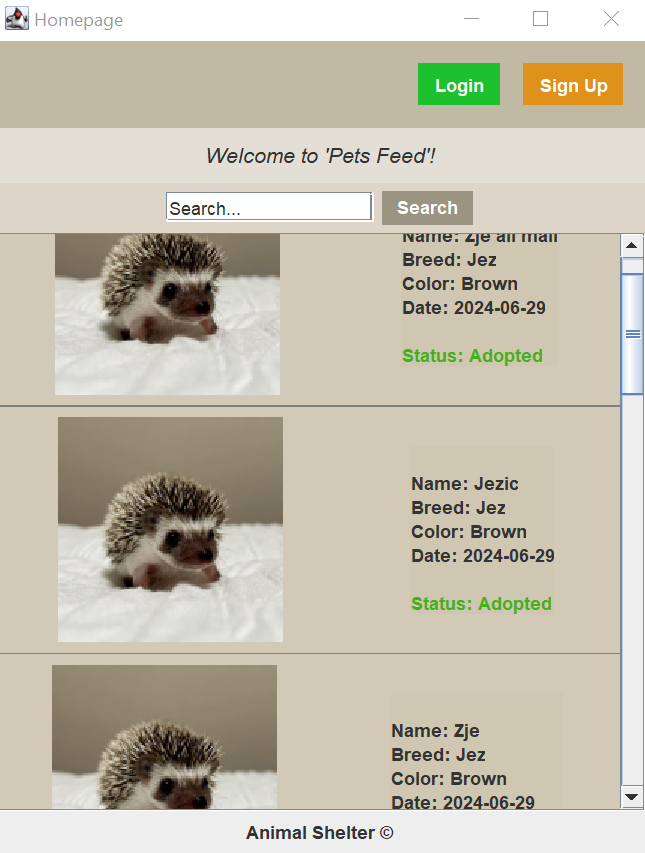
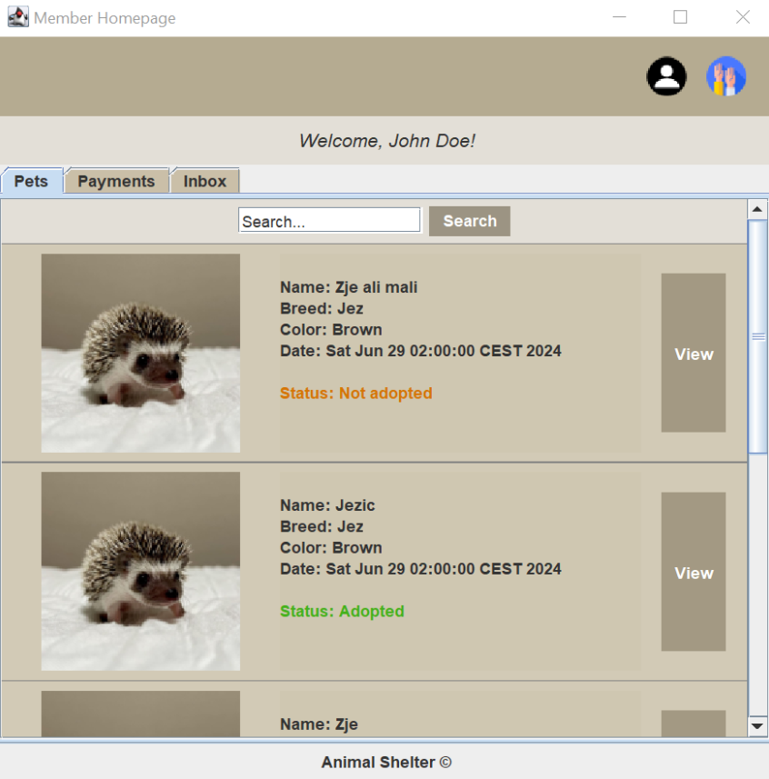
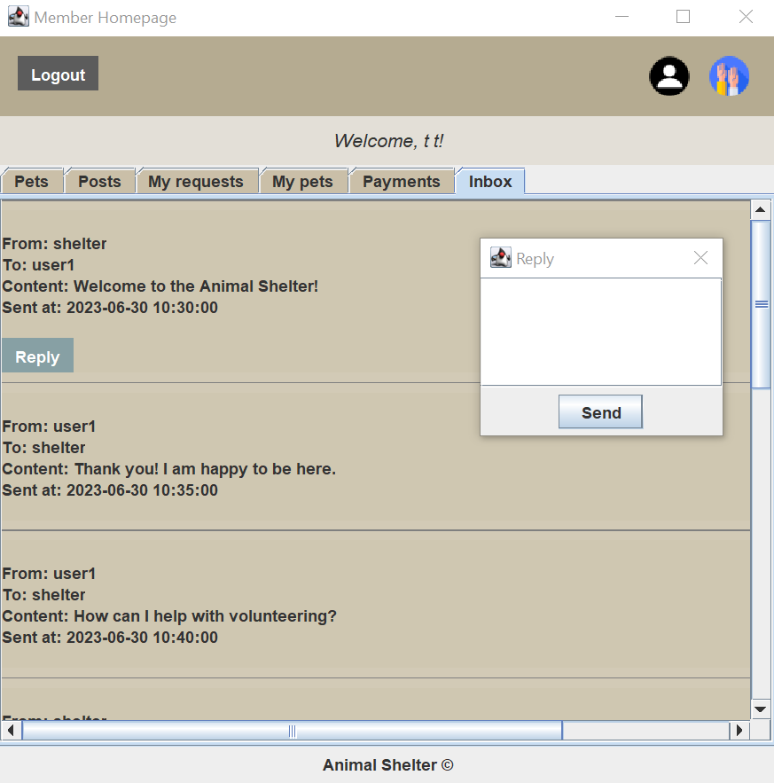
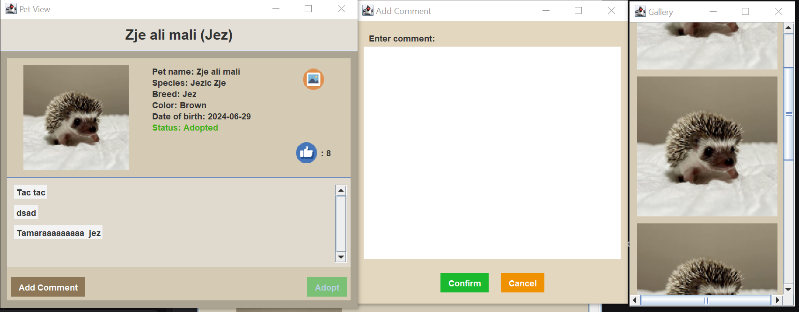

# Animal Shelter 🦔🐾

A GUI application for an animal shelter organization.

---

This was a university project for the course "Software Specification and Modeling", taken in the 4th semester of the Software Engineering and Information Technologies program.

The ``goal`` of the project was to:
- practice gathering requirements and writing a project specification based on meeting with the professor acting as a real-life client,
- design and create UML diagrams, including: use-case, class, state, and activity diagrams,
- build a working prototype that resembles a real product,
- focus on the quality of the code and project structure,
- regularly consult with the professor and assistants to stay on the right track,
#
Technologies used: 
- ``Java``
- ``Java Swing``
#
Date: July, 2024.

---

# How does it work? ❓
- provides login and registration options,
- based on the user role, enables:
  - pet adoption,
  - putting pets up for adoption,
  - CRUD operations and application management,
  - reviewing pets,
  - commenting on pets,
  - messaging users, etc.

---

# Visual Design ✨

---

# Using the Application ⚙️

To use this application, follow the next steps:
1) clone this repo,
2) run the program in IntelliJ
